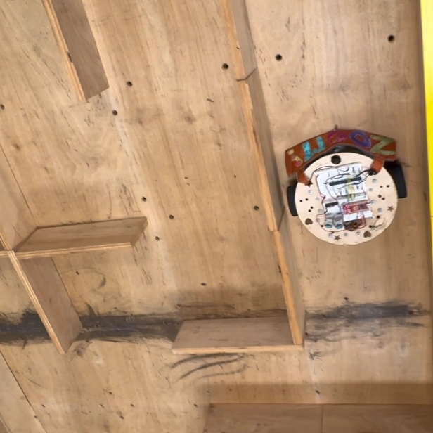

#  Microprocessors Robot Final

## Video

> Click on the image above to download the video of the robot going through a maze.

## Pictures

> Front and the back of the Robot

I designed the layout, used a laser cutter for the wood, hand-sewn the cape, assembled the robot, and coded the microprocessor to do a right wall following program. 
There is a timer interrupt and when it goes off the robot checks three IR sensor values and moves accordingly. 

MicroChip: PIC18F16Q41
